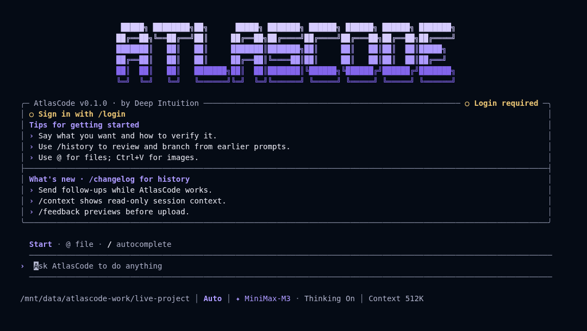

<p align="center"></p>

# AtlasCode
### by Deep Intuition · v0.1.0

A terminal coding agent for understanding repositories, editing files, running commands, and continuing work across sessions. This first release changes the product identity and theme, not the underlying agent architecture. Pi remains Pi.

## Install the release

Use the **local release tarball included in `AtlasCode-v0.1.0.zip`**. It has not been published to the npm registry.

Requires Node.js **22.19+ in the 22.x line**, or **24.2+ through 26.x**, and a terminal. Native dependencies may require a C++ build toolchain when a prebuilt binary is unavailable.

```bash
npm install -g ./distribution/deepintuition-atlascode-0.1.0.tgz
atlascode --version
atlascode
```

Run those commands from the extracted release directory. On Windows use PowerShell with the same `npm` commands. Do not use an old vendor installer: it installs a different product. Platform qualification and any skipped checks are recorded in the release evidence, not inferred from package compatibility.

## Connect your model

AtlasCode preserves the existing model/provider system. Bring your own key to an OpenAI-compatible or Anthropic-compatible endpoint, or explicitly select a managed provider integration.

```bash
# Read the key without echoing it to your terminal history (Bash).
read -rsp 'API key: ' ATLASCODE_PROVIDER_API_KEY; echo
export ATLASCODE_PROVIDER_API_KEY
atlascode provider add --name "My provider" \
  --base-url "https://YOUR-PROVIDER/v1" \
  --api-format openai-completions \
  --model "YOUR-MODEL-ID" \
  --context-limit 131072 --output-limit 8192 --use
unset ATLASCODE_PROVIDER_API_KEY
atlascode
```

Replace the endpoint, model, and limits with values your provider actually supports. `--use` tests the connection before saving and selecting it. Keys are stored by the existing configuration system; protect your profile directory and do not commit it. In PowerShell set `$env:ATLASCODE_PROVIDER_API_KEY` using your normal secret-management workflow. See `atlascode provider --help` for all options.

## Work in your project

```bash
cd /path/to/your/project
atlascode
# Or run one task without the TUI:
atlascode exec "Inspect this repository and explain how the tests are run"
# Resume the latest session in this project:
atlascode --continue
```

The existing `/help`, `/model`, `/sessions`, `/history`, `/context`, `/permission`, `/tasks`, `/agent`, `/plugin`, and other commands remain available according to the runtime's supported capabilities. Do not grant full tool permissions to untrusted projects. Review filesystem and shell changes before approving them.

## Same interface, new identity

The existing terminal layouts, composer, tool blocks, reasoning display, task views, keyboard behavior, session persistence, context management, and permission architecture are retained. The new dark and light palettes use Deep Intuition's violet, navy, and neutral visual language. No new execution engine, memory system, or agent capability is introduced.



## Data, updates, and compatibility

Fresh profiles live in `~/.atlascode`. `ATLASCODE_DATA_DIR` selects an isolated profile. Historical profile paths, database payloads, primary-agent aliases, imported plugin formats, and external wire identifiers are retained only where required for safe compatibility. See [migration notes](docs/migration.md) before importing an old profile.

This archive is independently installable. Update by installing a later reviewed AtlasCode tarball. It does not silently download another vendor's CLI. The existing signature-verifying updater can use an explicitly configured AtlasCode release feed; this release does not invent a hosted feed or signing identity.

## Build and test from source

```bash
corepack enable
corepack prepare pnpm@9.12.0 --activate
pnpm install --frozen-lockfile
pnpm build
node dist/cli.js --version
pnpm test:smoke
pnpm test:byok
pnpm test:capabilities
node scripts/package-atlascode.mjs
```

Use the `source` directory included in the ZIP. First installation/build requires public dependency access. The build verifies the upstream helper archive before applying the documented product-only identity patch. New workspace package names are resolved locally; there is no private AtlasCode package registry dependency.

## Evidence and boundaries

The distribution contains build/install checks, regression results, terminal captures, brand scans, and a real-runtime tool workflow driven through a live assistant relay. Deterministic fixture-provider tests are labelled separately. A live relay is not a claim that a separately hosted commercial provider was qualified. Hosted account, billing, cloud plugins/connectors, and external services require their own authorized credentials and are not represented as independently operated Deep Intuition services.

[Installation](docs/installation.md) · [Architecture](docs/architecture.md) · [Verification](docs/verification.md) · [Provider and branding boundaries](docs/retained-identifiers.md) · [Upstream provenance](UPSTREAM.md) · [Third-party notices](THIRD_PARTY_NOTICES.md)

## License

MIT for the first-party source, with dependency-specific notices. Original copyright and license notices are retained. Deep Intuition's changes cover product identity, theme, distribution, compatibility repairs, and qualification. We do not claim authorship of Pi or other upstream dependencies.
